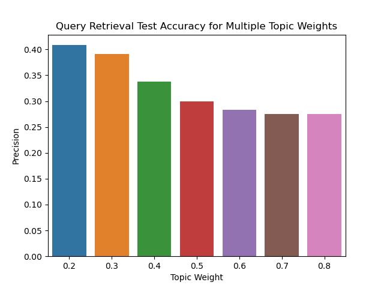

# DePaul Course Catalog Information Retrieval System

## Purpose
The purpose of this project is to create an information retrieval system to improve a few limitations of using DePaul's Campus Connect 
course search system. A few of the current limitations are:  
- Queries that contain a keyword that's part of a course description won't result in the course being retrieved 
- Misspellings and plural forms of terms that don't match the course name won't retrieve the course 
- Searching multiple terms results in no courses being retrieved unless all the terms are within the same course title 

The goal of this new information retrieval system is to eliminate the above limitations and provide a weighted similarity score 
based on if the query term appears in the course title or course description, giving a higher weight for terms in the course title.
As of now, the new information retrieval system only works with the 48 courses that are offered as part of the <a href="https://www.cdm.depaul.edu/academics/Pages/current/Requirements-MS-In-Data-Science-Computational-Methods.aspx">Data Science
Computational Method's</a> concentration curriculum.

## Information Retrieval System Demo
<a href="https://youtu.be/WmuQJ4BDwx8">Demo</a>

## Files
<ul>
<li>course_crawler.py</li>
<li>course_indexing.py</li>
<li>course_query.py</li>
<li>system_test_indexing.py</li>
<li>system_test_query.py</li>
<li>system_test_results.py</li>
<li>course_db.py
<ul><li>Work in Progress for Server Side Development</li></ul>
</li>
<li><a href="http://ir.dcs.gla.ac.uk/resources/test_collections/medl/">MedLine Testing Data</a></li>
<ul><li>Used for System Test</li>
</ul>
</ul>

## Instructions
1) To use the information retrieval query system first the course_crawler.py file needs to be run to gather the documents for the system. This file creates as output two JSON files (courses.json and docID_mapping.json). This file doesn't need to be run again unless updating the course collection.
2) Next, the course_indexing.py file needs to be run to index the documents. The output of this file is four json files (info_index.json, info_postings.json, topic_index.json, topic_postings.json). This file does not need to be run again unless the course_crawler has obtained more documents.           
3) The course_query.py uses the five previously mentioned json files to return the courses most similar to the user based on their query. To run this file, the user needs to create the object QueryRetrieval (which is commented out at the bottom of the code). With this object the user can run self.RetrieveDocs(query) with their query as a string. This will open up the most similar courses to the query in separate web browser tabs.
4) The system can be tested using the MedLine test collection from the above resource
5) This step can be skipped using the files within the TestFiles directory. Otherwise, the system_test_indexing.py needs to be run. Afterwards system_test_query.py can be run. FYI this file takes a significant amount to run since it tests different weighting schemes for the 30 test queries.
6) Afterwards, system_test_results.py can be run to view which weighting value resulted in the highest retrieval accuracy. Since the MedLine testing collection won't be changing this file can run with the files within the TestFiles directory.

## Test Results

